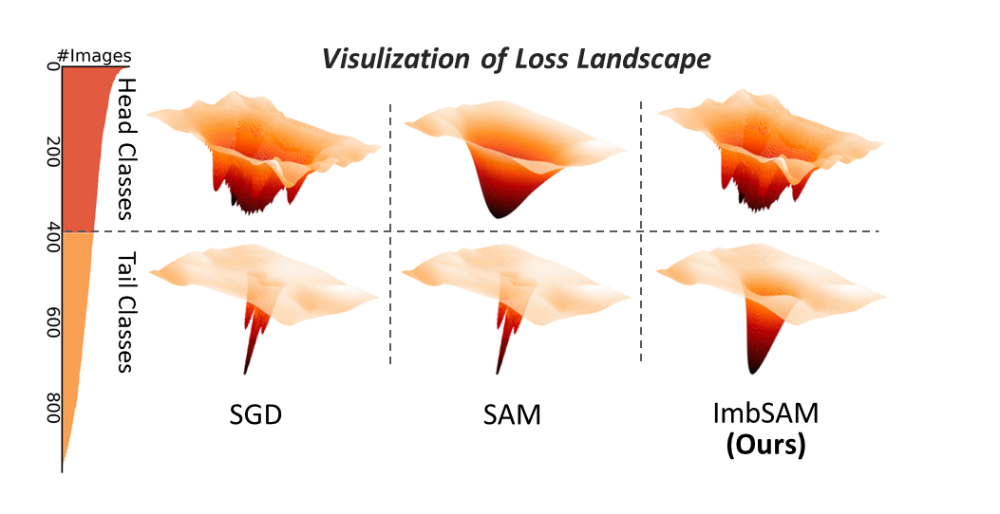

# Imbalanced_SAM

This is an official implementation of "[ImbSAM: A Closer Look at Sharpness-Aware Minimization in Class-Imbalanced Recognition](https://arxiv.org/abs/2308.07815)" (Accepted by ICCV2023).

## Abstract
Class imbalance is a common challenge in real-world recognition tasks, where the majority of classes have few samples, also known as tail classes. We address this challenge with the perspective of generalization and empirically find that the promising Sharpness-Aware Minimization (SAM) fails to address generalization issues in class-imbalanced recognition.  Through investigating this specific type of task, we identify that its generalization bottleneck primarily lies in the severe overfitting for tail classes with limited training data. To overcome this bottleneck, we leverage class priors to restrict the generalization scope of the class-agnostic SAM and propose a class-aware smoothness optimization algorithm named Imbalanced-SAM (ImbSAM). With the guidance of class priors, our ImbSAM specifically improves generalization targeting tail classes. We also verify the efficacy of ImbSAM on two prototypical applications of class-imbalanced recognition: long-tailed classification and semi-supervised anomaly detection, where our ImbSAM demonstrates remarkable performance improvements for tail classes and anomaly.



## Enviroment
- PyTorch 

## Datasets
The `train.py` will automatically download the CIFAR100 into `./datasets` dir.

## train
```shell
python scripts\train.py \
    --imb_factor ${IMBALANCED FACTOR} \
    --opt ${OPTIMIZER in ['sgd', 'sam', 'imbsam']} \
    --rho ${RHO_IN_SAM OR IMBSAM} \
    --eta ${ETA_IN_IMBSAM} \
```

## Results on CIFAR100-LT (IF=100)
| Optimizer |   Many   |   Med.   |   Few    |   ALL    |
| --------- | :------: | :------: | :------: | :------: |
| SGD       |   77.8   |   46.6   |   13.5   |   47.6   |
| SAM       | **79.7** |   49.3   |   12.4   |   48.9   |
| ImbSAM    |   75.9   | **53.5** | **19.4** | **51.1** |

The trained model is available at [OneDrive](https://1drv.ms/u/s!AsjdCOUsl_IRjt1KK7v79XqGDmkqDQ?e=v6CoKJ), which achieves better performance (ALL Acc of 51.6) than reported results in our paper.

## Thanks to

- [ASAM](https://github.com/SamsungLabs/ASAM)
- [WB](https://github.com/ShadeAlsha/LTR-weight-balancing)
